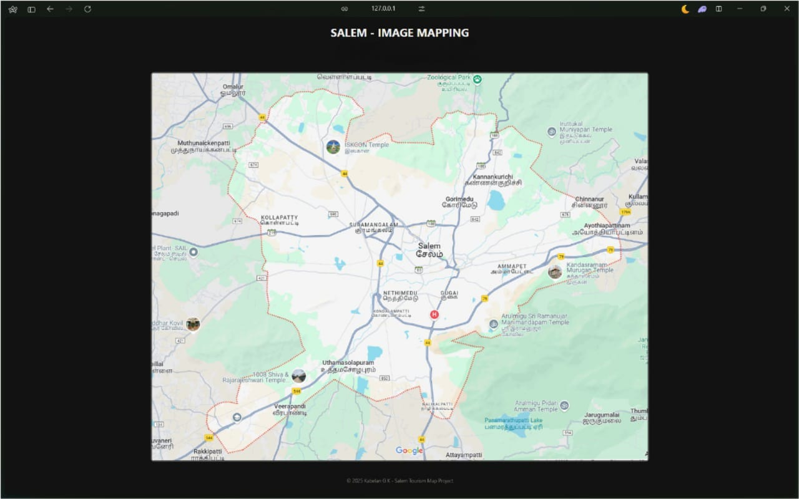
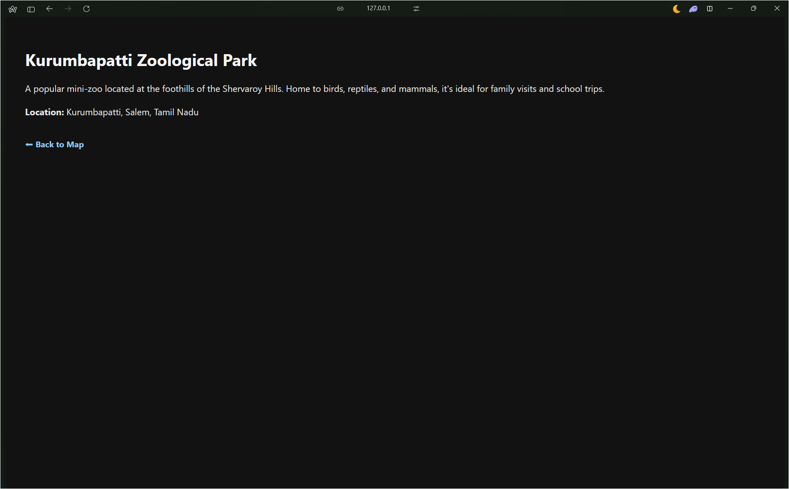
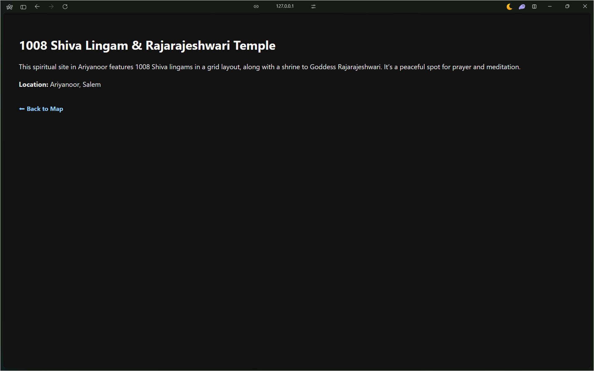
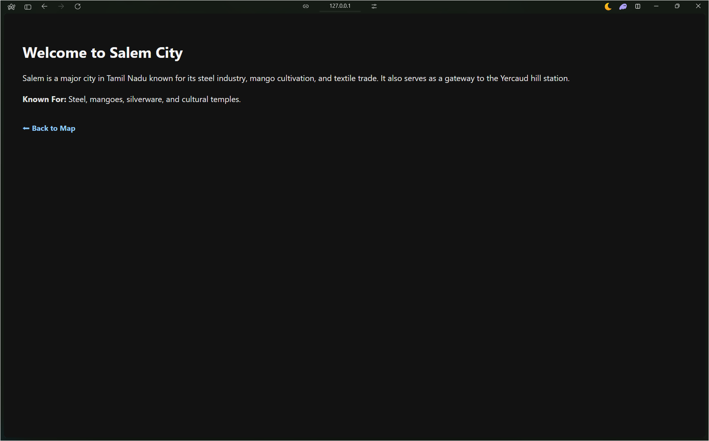

# Ex04 Places Around Me
## Date: 12.11.25

## AIM
To develop a website to display details about the places around my house.

## DESIGN STEPS

### STEP 1
Create a Django admin interface.

### STEP 2
Download your city map from Google.

### STEP 3
Using ```<map>``` tag name the map.

### STEP 4
Create clickable regions in the image using ```<area>``` tag.

### STEP 5
Write HTML programs for all the regions identified.

### STEP 6
Execute the programs and publish them.

## CODE
### MapApp.html
```html
<!DOCTYPE html>
<html lang="en">
<head>
    <meta charset="UTF-8" />
    <meta name="viewport" content="width=device-width, initial-scale=1.0"/>
    <title>SALEM - IMAGE MAPPING</title>
    <script src="https://cdn.jsdelivr.net/npm/image-map-resizer@1.0.10/js/imageMapResizer.min.js"></script>
    <link rel="stylesheet" href="./style.css">
</head>
<body>
    <h1>SALEM - IMAGE MAPPING</h1>
    <h2>KABELAN G K - 212224110027</h2>

    

    <map name="MyCity">
        <area shape="rect" coords="496,192,653,252" href="Iskcon.html" alt="Iskcon Salem">
        <area shape="rect" coords="779,1,956,60" href="Zoo.html" alt="Kurumbapatti Zoo">
        <area shape="rect" coords="203,846,447,896" href="1008.html" alt="1008 Shiva Temple">
        <area shape="rect" coords="758,483,844,533" href="Salem.html" alt="Salem City">
    </map>

    <footer>&copy; 2025 Kabelan G K - Salem Tourism Map Project</footer>

    <script>
        window.onload = function () {
            imageMapResize();
        };
    </script>
</body>
</html>
```

### Iskcon.html
```html
<!DOCTYPE html>
<html lang="en">
<head>
    <meta charset="UTF-8">
    <title>Iskcon Temple Salem</title>
    <link rel="stylesheet" href="./other.css">
</head>
<body>

    <h1>ISKCON Temple, Salem</h1>
    <p>The ISKCON Temple in Salem is dedicated to Lord Krishna. It features traditional temple architecture, regular devotional activities, and a peaceful spiritual ambiance.</p>
    <p><strong>Location:</strong> Karuppur, Salem, Tamil Nadu</p>
    <a href="MapApp.html">⬅ Back to Map</a>

</body>
</html>
```

### Zoo.html
```html
<!DOCTYPE html>
<html lang="en">
<head>
    <meta charset="UTF-8">
    <meta name="viewport" content="width=device-width, initial-scale=1.0">
    <title>Zoo</title>
    <link rel="stylesheet" href="./other.css">
</head>
<body>
<h1>Kurumbapatti Zoological Park</h1>
<p>A popular mini-zoo located at the foothills of the Shervaroy Hills. Home to birds, reptiles, and mammals, it's ideal for family visits and school trips.</p>
<p><strong>Location:</strong> Kurumbapatti, Salem, Tamil Nadu</p>
<a href="MapApp.html">⬅ Back to Map</a>  
</body>
</html>
```

### 1008Temple.html
```html
<!DOCTYPE html>
<html lang="en">
<head>
    <meta charset="UTF-8">
    <meta name="viewport" content="width=device-width, initial-scale=1.0">
    <title>Zoo</title>
    <link rel="stylesheet" href="./other.css">
</head>
<body>
    <h1>1008 Shiva Lingam & Rajarajeshwari Temple</h1>
    <p>This spiritual site in Ariyanoor features 1008 Shiva lingams in a grid layout, along with a shrine to Goddess Rajarajeshwari. It’s a peaceful spot for prayer and meditation.</p>
    <p><strong>Location:</strong> Ariyanoor, Salem</p>
    <a href="MapApp.html">⬅ Back to Map</a>  
</body>
</html>
```

### Salem.html
```html
<!DOCTYPE html>
<html lang="en">
<head>
    <meta charset="UTF-8">
    <meta name="viewport" content="width=device-width, initial-scale=1.0">
    <title>Zoo</title>
    <link rel="stylesheet" href="./other.css">
</head>
<body>
    <h1>Welcome to Salem City</h1>
    <p>Salem is a major city in Tamil Nadu known for its steel industry, mango cultivation, and textile trade. It also serves as a gateway to the Yercaud hill station.</p>
    <p><strong>Known For:</strong> Steel, mangoes, silverware, and cultural temples.</p>
    <a href="MapApp.html">⬅ Back to Map</a>
</body>
</html>    
```


## OUTPUT



 

## RESULT
The program for implementing image maps using HTML is executed successfully.
